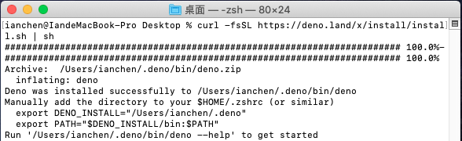
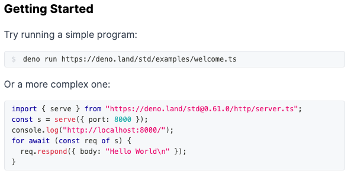
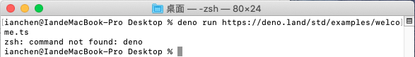
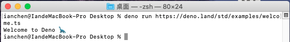
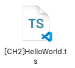
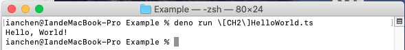

# 強型闖入DenoLand[2] - Hello, World!

> 今天進入到了一個相當重要的篇章，筆者認為這是學習一樣新的程式語言時最愉快的環節沒有之一。
>
> ~~因為之後等待你的將是無盡的地獄。~~

不過，在正式開始之前，我們有一件同樣重要的事情要做：搭建開發環境。

> 沒有開發環境，語法再熟也不過是空談，除非你就是Compiler本人。

## 搭建開發環境

> 筆者本人是使用ＭacOS，因此範例的圖片也是從MacOS所擷取下來的。
>
> 其他作業系統會在一部分的步驟上有些許的不同，本文一樣會把它點出來。

尷尬的事來了，其實安裝Deno十分容易，基本上一行指令秒殺：

> 讀者現在一定會覺得：那你剛剛跟我閒扯這麼多幹嘛呢？
>
> 其實是因為我是一邊寫文章一邊初體驗Deno的，我認爲這樣子所產出的文章會有更生動的感覺。

1. 打開你的CMD或是終端機。

2. 根據不同的作業系統，會有不同的命令需要輸入：

   Shell (Mac, Linux):

   ```bash
   $curl -fsSL https://deno.land/x/install/install.sh | sh
   ```

   PowerShell (Windows):

   ```bash
   $iwr https://deno.land/x/install/install.ps1 -useb | iex
   ```

   [Homebrew](https://formulae.brew.sh/formula/deno) (Mac):

   ```bash
   $brew install deno
   ```

   [Chocolatey](https://chocolatey.org/packages/deno) (Windows):

   ```bash
   $choco install deno
   ```

   Scoop (Windows):

   ```bash
   $scoop install deno
   ```

   Build and install from source using [Cargo](https://crates.io/crates/deno)

   ```bash
   $cargo install deno
   ```

3. 大功告成，一切就是這麼的簡單、愉快。

   

> 上述指令都是由Deno Doc所提供，[來源](https://deno.land/#installation)在這裡。

## Hello, World!

> 你如果問我現在要幹嘛？
>
> 我很想告訴你我們現在就來做Hellp, World!儀式吧！！！
>
> 可是....Deno Doc上竟然還有一個步驟！
>
> 身為一個Deno初學者，乖乖遵守官方文件是必須的唷> <

### 當個好寶寶



>  休但幾勒，就在這時，筆者竟然遇到麻煩了！！！
>
>  
>
>  系統竟然找不到deno這道指令，怎麼辦呢？
>
>  放心，這只是因為我們沒有設定環境變數所造成的，我們只要參考[這篇文章](https://tute.io/install-deno-macos)設定之後，便能順利執行囉～！
>
>  貼心提醒：做完`Manually add the directory to your $HOME/.zshrc or $HOME/.bash_profile`這個步驟時，請記得下`source ~/.bash_profile`這道指令，不然Deno仍然不會理你。



> 經過一番波折，筆者終於看到了小恐龍的身影....。

### 欲善其事 必先利其器

> 接下來，我們可以進入正題了嗎？
>
> 不行！要做出好的產品，我們勢必需要好的工具，就像劉備配諸葛亮有如魚得水一般。

所以，在開始之前，請先到VSCode官網下載並安裝好這套強大的編輯器。

連結在這裡：[VSCode](https://code.visualstudio.com/)

### 進入正題

終於....我們可以開始進行Hello, World!儀式了...

1. 首先，我們創建一個新檔案，其副檔名為ts。

   

2. 使用VSCode打開你剛剛創建的檔案，並輸入：

   ```
   console.log("Hello, World!")
   ```

   輸入好後，請記得存檔。

3. 打開我們的終端機輸入：

   ```
   deno run YourCode.ts
   ```

   > 貼心提醒：VSCode內建終端機，如果要呼叫它請按組合鍵：
   >
   > `Ctrl`+*`*

4. 查看結果

   

4. 做到這邊，筆者實在是感動到說不出話了，看似簡單的幾個步驟，竟然花了我一個多小時....Q_Q

## Hello, World!的由來

