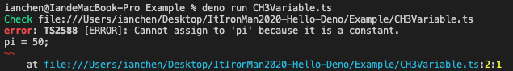
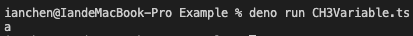

# 強型闖入DenoLand[3] - TS基礎系列之變數宣告(1)

> 在介紹完Deno由來以後，我們正式進入到了TypeScript的學習路程上，開始之前還是想先讓讀者知道為何我們需要學會TypeScript。

Deno由於使用了V8引擎以及內建TypeScript編譯器，所以不管是Js或是Ts都能直接在Deno運行。

> 因此本系列文並不會花時間教大家如何安裝TypeScript的編譯器，因為我們的重點是`在Deno中利用TypeScript寫出可執行的程式碼`，而不是純粹的TypeScript教學文章。

TypeScript相比JavaScript，多出了型別系統、型別預判、對物件導向的實作方面...等也有更全面的支持，不過TypeScript其實就是JavaScript的超集合，JavaScript支持的API在TypeScript都是可用的。

- 知識點：應用程序接面 (API, Application Programing Interface)

  > 太神奇了傑克，不用寫程式就能動誒。
  >
  > -- CC.T

## 從JS搬遷到TS

> 本小節將探討如何將現有的JavaScript程式檔搬遷到TypeScript上。

1. 將你的`.js`檔案準備好。
2. 將`.js`副檔名重新命名為`.ts`。
3. 搬遷成功！

> 前面提到`TypeScript其實就是JavaScript的超集合`，所以搬遷後的程式碼是完全可以正常運行的！

> 注意：其實這樣做一點意義都沒有，因為這樣並不會讓我們體驗到型別預判所帶來的好處。

## 變數宣告

>  注意！`TypeScript其實就是JavaScript的超集合`，或許筆者會認為我不斷的提醒很多餘，但在這個觀念根深蒂固以後，之後才能更快上手，不會有`這個到底是JS還是TS的語法啊？`這種充滿不確定的想法出現。

在加入強型別之前，我們先讓大家暸解在JavaScript上，我們是如何宣告變數的吧！

主要宣告方式有三種，分別是`const`、`let`、`var`，至於這三種宣告方式的主要差異到底在哪裡，就讓我們繼續看下去吧！

### const

Const通常用於宣告永恆不變的數值（識別值），什麼意思呢？像是`PI=3.14...`就是確定不會改變的數字。

>  如果哪天被數學家推翻的話，那就另當別論了。

```javascript
const pi = 3.14159;
```

那我們試試看更改`PI`變數的數值吧！

```javascript
const pi = 3.14159;
pi = 50;
```

果不其然，執行的結果還是報錯了。

> 沒事還是不要挑戰程式語言的規則，就像是：開車不喝酒，喝酒不開車一樣。



介紹完`const`後，我們就來看看`let`以及`var`的差異吧！

> 三種宣告方式之中，只有`const`有不可改變的特性唷！

### var

> 宣告一個變數, 同時可以非強制性地賦予一初始值。
>
> -- [MDN web docs](https://developer.mozilla.org/zh-TW/docs/Web/JavaScript/Reference/Statements/var)

相較`const`，利用`var`所聲明的函數可以重複的進行賦值。

```javascript
var x = 'hello';
x = 'hi';
```

### let

> **`let`**用於宣告一個「只作用在當前區塊的變數」，初始值可選擇性的設定。
>
> -- [MDN web docs](https://developer.mozilla.org/zh-TW/docs/Web/JavaScript/Reference/Statements/let)

```javascript
let y = "123";
y = "456";
```

當然，`let`同樣也可以讓我們對其宣告的變數重新賦值。

## 基礎型別有哪些？

> 雖說JS是弱型別語言，但那不代表JS不存在型別！
>
> 只不過是宣告變數時不需要宣告型別罷了。


## 修但幾勒，他們兩個差在哪？：範圍鍊

> `var`可以重新賦值，`let`也可以重新賦值，那他們到底差在哪？

別急，接下來先跟各位讀者談談在JS中一個十分重要的概念，也就是範圍鍊。

> 範圍鍊是什麼呢？為何聽起來這麼專業？

在解釋範圍鍊之前，讀者可以先看看下面這段程式碼：

```javascript
let x = 'a';
function print(){
  let x = 'b';
  console.log(x)
}
print() //'a'or'b'?
```

如果你的答案是`b`，那恭喜你，你答對了。

> 會出現這樣的結果是因為當`print()`執行時，直譯器讀到`console.log(x)`便會開始尋找`x`這個變數，如果函數內就能找到，
>
> 便將`let x = 'b';`所指定的值（字串`b`）印出在終端機上。

相對的，如果今天程式碼長成這樣:

```javascript
let x = 'a';
function toy(){
  let x = 'c';
}
function print(){
  console.log(x)
}
print() //'a'or'b'?
```

透過`範圍鍊`的觀念我們可以知道，當直譯器無法在`print()`當中找到`x`，我們就會跳到更上一層去尋找

`x`（從範例當中看剛好是全域。），因此我們最後會在終端機上看到：



> 那`toy()`是？都沒有用到幹嘛出現在範例上呢？

喔，沒有啦！那只是單純要混淆讀者，看大家的觀念清不清晰罷了XD

會先告訴讀者`範圍鏈`的概念是因為：`let`與`var`界定範圍的方式不一樣！

> 怎麼個不一樣法呢？

`let`主要是以`block`去做區隔。

> 阿什麼是`block`？

```javascript
{}
```

這就是`block`。

至於`var`，它是使用`function`作為界線的，請不要問我什麼是`function`，謝謝。

## 工程師都必須知道的事：暫時性死區

> 在暸解變數是如何宣告之後以及其作用域之後，我們一起來看看`暫時性死區`這個聽起來十分牛逼的技術名詞吧！

## 總結

哇！經過一天，各位讀者一共學到了`暫時性死區`、`範圍鏈`、`型別概念`，是不是覺得自己變的更加專業了呢？

> 請不要告訴我沒有，謝謝。

## 延伸閱讀

> 同樣的事情在不同人眼中可能會有不同的見解、看法。
>
> 在讀完本篇以後，筆者也強烈建議大家去看看以下文章，或許會對型別、變數宣告...等觀念有更深層的看法唷！

- 重新認識JavaScript

  > 重新認識JavaScript是由台灣Vue.js社群的大大 - Kuro 所編寫，該系列將許多重要觀念羅列出來並且寫的淺顯易懂，十分牛逼。

  - [變數與資料型別](https://ithelp.ithome.com.tw/articles/10190873)

    > 筆者認為自己實在有點過度貪心，想要在30天中講一卡車的東西。
    >
    > 但是又深怕讀者對於哪些部分想要有更多的認知，如果對於資料型別還有更深層的渴望，請參考這篇。

  - [範圍鍊](https://ithelp.ithome.com.tw/articles/10193009)

    > 該篇介紹範了圍鍊、閉包的文章十分推薦讀者欣賞。

- MDN web docs

> 由Mozilla所維護的web百科大全，我們可以在上面找到99.9%任何你想知道的事（前端基礎）。
>
> 這樣的開源精神著時令人敬佩，如果大家的英文不錯也可以使用GitHub登入以後協助文章的翻譯，一起造福廣大開發者。