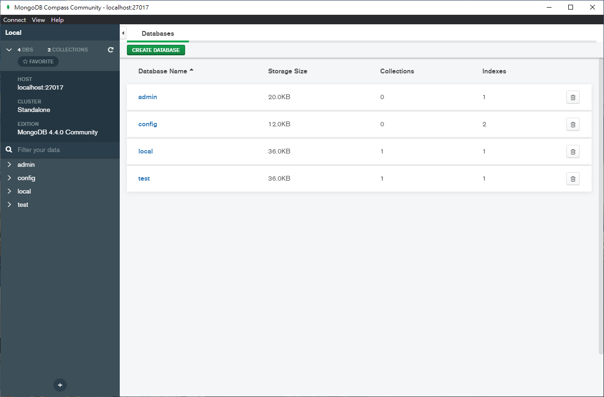
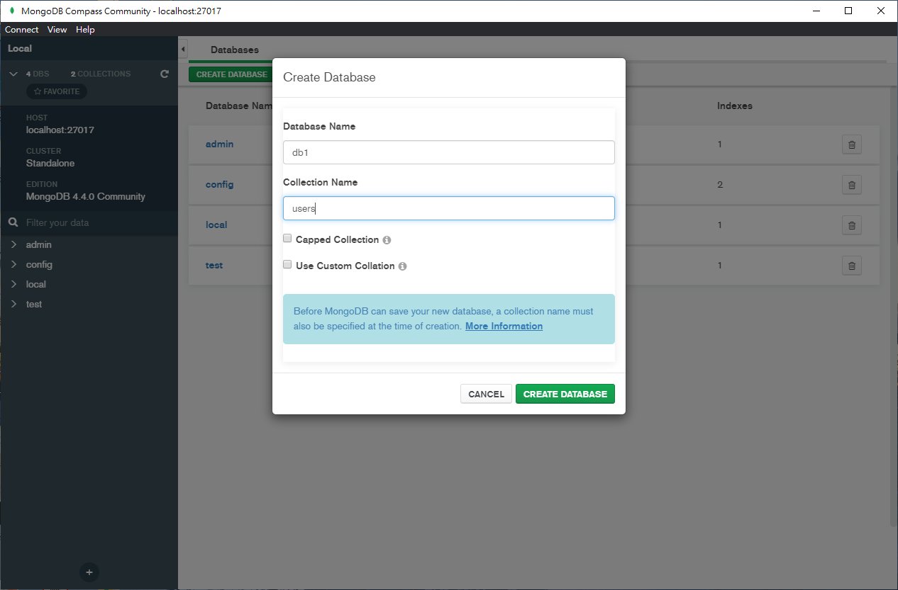
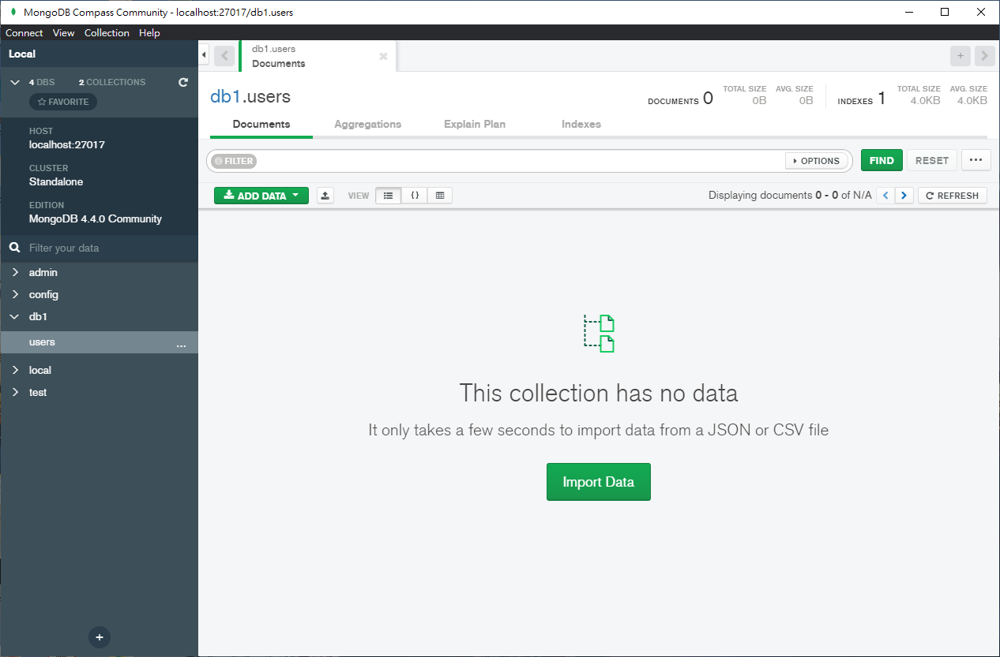

# 強型闖入DenoLand[32] - 使用 Deno 串接 MongoDB 

在安裝 MongoDB 後，來看看要如何使用 Deno 串接 MongoDB 吧！

## 開始之前： 設定 collection 以及 database

繼昨天的安裝教學，我們現在來建立待會要使用的 database 以及 collection ：

1. 打開 MongoDB Compass 並按下 `Create Database` 。



2. 輸入 Database 和 Collection 的名字：



3. 創建完成，如果讀者有需要，也可以先插幾筆資料進去。



## 進入正題： deno_mongo 教學

`deno_mongo` 是一款 MongoDB 資料庫驅動的 Deno 第三方套件，它是基於 rust 官方的 mongoldb Library 所打造的。

### 建立連線

在開始之前，需要將第三方模組引入：

```typescript
import { MongoClient } from "https://deno.land/x/mongo@v0.13.0/mod.ts";
```

引入後，將 `MongoClient` 物件實例化：

```typescript
const client = new MongoClient();
```

開啟 MongoDB 後，就可以使用 `client` 建立連線：

```typescript
client.connectWithUri("mongodb://localhost:27017");
```

執行到這一步時，就已經成功連上 MongoDB 了，不過我們還沒告訴 Deno 要存取資料庫中的哪一個 database 和 collection ：

```typescript
const db = client.database("test");
const users = db.collection("users");
```

上面的範例是讓 Deno 連上 MongoDB 中 `test` database  的 `users` collection 。

### 使用 Interface 防止非預期資料寫入 MongoDB

使用 Interface 可以有效預防有心人士在 json 格式內插入不需要的資料。

假設我們預期 collection 的欄位只有 `id` 、 `username` 以及 `password` ，可以先定義好 interface ：

```typescript
interface UserSchema {
  _id: { $oid: string };
  username: string;
  password: string;
}
```

定義好後，我們在連結 collection 的那行程式碼加入 interface 檢查：

```typescript
const db = client.database("test");
const users = db.collection<UserSchema>("users");
```

## 常見操作

在學會如何與 MongoDB 建立連線後，跟著筆者一起看看 deno_mongo 提供的操作方法吧！

> 注意！進行以下常見操作都需要先將 Deno 與 MongoDB 做連接唷！
>
> ```typescript
> import { MongoClient } from "https://deno.land/x/mongo@v0.13.0/mod.ts";
> const client = new MongoClient();
> client.connectWithUri("mongodb://localhost:27017");
> const db = client.database("test");
> const users = db.collection("users");
> ```

### 新增單筆資料

```typescript
const insertId = await users.insertOne({
  username: "user1",
  password: "pass1",
});
```

### 新增多筆資料

```typescript
const insertIds = await users.insertMany([
  {
    username: "user1",
    password: "pass1",
  },
  {
    username: "user2",
    password: "pass2",
  },
]);
```

### 尋找單筆資料

```typescript
const user1 = await users.findOne({ _id: insertId });
```

### 尋找多筆資料

```typescript
const all_users = await users.find({ username: { $ne: null } });
```

### 計數

計算 Collection 中有多少筆資料包含使用者輸入的鍵值對 ：

```typescript
const count = await users.count({ username: { $ne: null } });
```

### 聚合

聚合操作主要用於處理數據 (像是：取平均值、加總等操作)並回傳計算後的結果。 

```typescript
const docs = await users.aggregate([
  { $match: { username: "many" } },
  { $group: { _id: "$username", total: { $sum: 1 } } },
]);
```

### 新增單筆資料

```typescript
const { matchedCount, modifiedCount, upsertedId } = await users.updateOne(
  { username: { $ne: null } },
  { $set: { username: "USERNAME" } }
);
```

### 新增多筆資料

```typescript
const { matchedCount, modifiedCount, upsertedId } = await users.updateMany(
  { username: { $ne: null } },
  { $set: { username: "USERNAME" } }
);
```

### 刪除單筆資料

```typescript
const deleteCount = await users.deleteOne({ _id: insertId });
```

### 刪除多筆資料

```typescript
const deleteCount2 = await users.deleteMany({ username: "test" });
```

### 跳過

我們可以使用 `skip()` 跳過指定數量的資料：

```typescript
const skipTwo = await users.skip(2).find();
```

### 限制

如果使用者需要在 MongoDB 中找尋數據並指定數據記錄的數量，可以使用 `limit()` ：

```typescript
const featuredUser = await users.limit(5).find();
```

## 執行

最後要注意的是， `deno_mongo` 目前還不穩定，使用上不要忘記加入 `--unstable` 標籤唷！

```
deno run --allow-net --allow-write --allow-read --allow-plugin --allow-env --unstable yourCode.ts
```

## 總結

今天我們學會了使用第三方套件去連線 MongoDB 。明天筆者就會將超簡易 WebAPI 留下的坑填完，順便分享一下什麼是 ORM ，我們明天見！

> 此外，本篇所使用的範例程式碼參考了 [deno_mongo](https://deno.land/x/mongo@v0.13.0) 的官方文件，請知悉。

